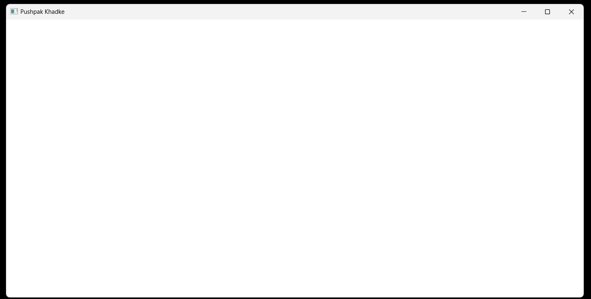

# Hello Win Project

This C code creates a basic Windows program showing the text "Pushpak Khadke" in a window. It uses the Win32 API to handle the window and messages. When you close the window, the program exits smoothly.

## Technology Stck

`Win32 API` <br>
`C Programming` <br>
`Vs Code`

## How To Run This Project

                                
1. You will need to navigate to the location of your source code folder by using the "cd" command.

     ```shell
   cd source_code_location

2. Build exe file using following command.

    ```shell
   cl /Fe:app.exe Hello_Win.c

3. Run exe file using following command.

    ```shell
   app.exe

## Output



