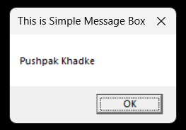

# Message Box Project

This program is a simple Windows application written in C that demonstrates the usage of the `MessageBox` function to display a modal dialog box with a custom message and title. It utilizes the Windows API and can be compiled and executed using the Microsoft C/C++ compiler (`cl`).

## Technology Stck

`Win32 API` <br>
`C Programming` <br>
`Vs Code`

## How To Run This Project

                                
1. You will need to navigate to the location of your source code folder by using the "cd" command.

     ```shell
   cd source_code_location

2. Build exe file using following command.

    ```shell
   cl /Fe:app.exe Hello_Win.c

3. Run exe file using following command.

    ```shell
   app.exe

## Output



