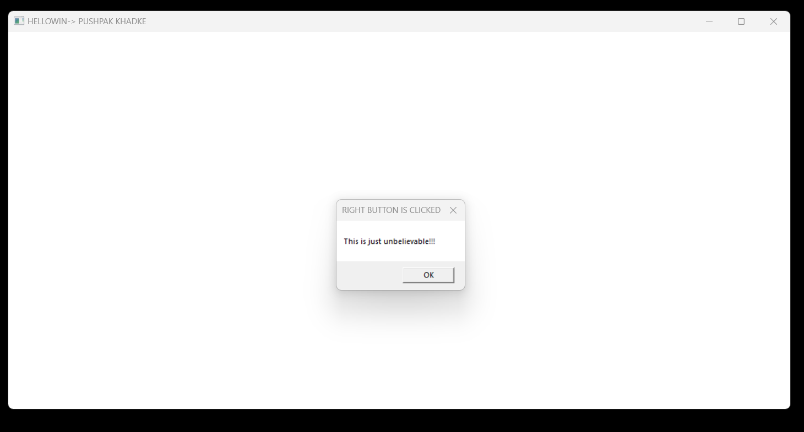

# Message Box Project

"This C program creates a basic graphical window on a Windows system using the Win32 API. It demonstrates how to handle user interactions, such as right-clicking the mouse, and displays a message box in response.

## Technology Stck

`Win32 API` <br>
`C Programming` <br>
`Vs Code`

## How To Run This Project

                                
1. You will need to navigate to the location of your source code folder by using the "cd" command.

     ```shell
   cd source_code_location

2. Build exe file using following command.

    ```shell
   cl /Fe:app.exe Hello_Win.c

3. Run exe file using following command.

    ```shell
   app.exe

## Output



