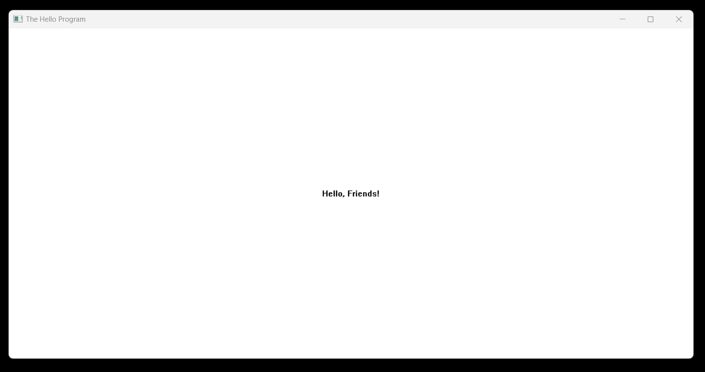

# Hello Win Project

This C project is a Windows application that opens a window saying "Hello, Friends!". It also plays a sound when the window appears. The code uses basic Windows functions to create the window and handle user interactions. It's a simple example to demonstrate how to create a graphical interface using C on Windows.

## Technology Stck

`Win32 API` <br>
`C Programming` <br>
`Vs Code`

## How To Run This Project

                                
1. You will need to navigate to the location of your source code folder by using the "cd" command.

     ```shell
   cd source_code_location

2. Build exe file using following command.

    ```shell
   cl /Fe:app.exe Hello_Win.c

3. Run exe file using following command.

    ```shell
   app.exe

## Output



