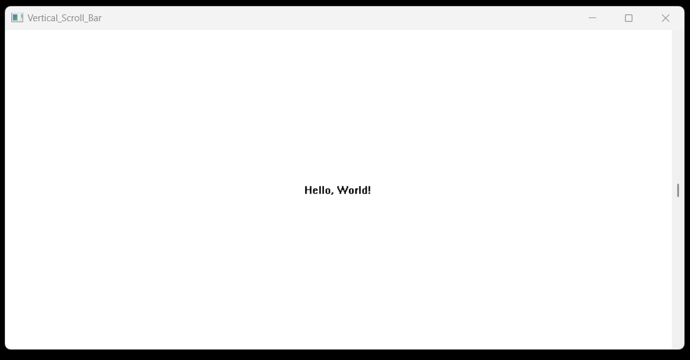

# Vertical Scroll Bar Project

This program demonstrates a basic graphical user interface (GUI) application using WinAPI in C. It creates a window titled "Hello, World!" with a vertical scroll bar, allowing users to scroll through the displayed text. The application showcases fundamental concepts such as window creation, message handling, drawing on the client area, and implementing a vertical scroll bar functionality.

## Technology Stack

`Win32 API` <br>
`C Programming` <br>
`Vs Code`

## How To Run This Project

                                
1. You will need to navigate to the location of your source code folder by using the "cd" command.

     ```shell
   cd source_code_location

2. Build exe file using following command.

    ```shell
   cl /Fe:app.exe Hello_Win.c

3. Run exe file using following command.

    ```shell
   app.exe

## Output



