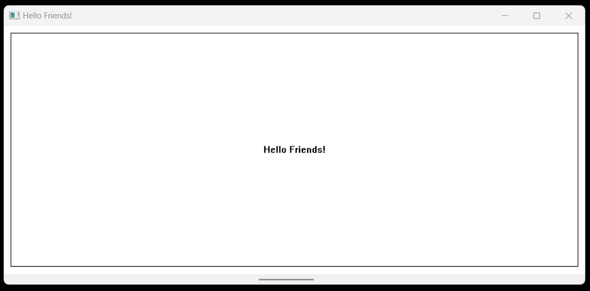

# Horizontal Scroll Bar Project

This project demonstrates a simple Windows GUI application using WinAPI to create a window with a horizontal scroll bar. The application displays the message "Hello Friends!" within a bordered frame, allowing users to scroll horizontally to view content exceeding the window's width.
## Technology Stck

`Win32 API` <br>
`C Programming` <br>
`Vs Code`

## How To Run This Project

                                
1. You will need to navigate to the location of your source code folder by using the "cd" command.

     ```shell
   cd source_code_location

2. Build exe file using following command.

    ```shell
   cl /Fe:app.exe Hello_Win.c

3. Run exe file using following command.

    ```shell
   app.exe

## Output



