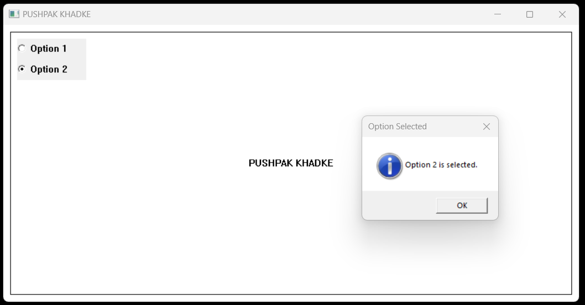

# Radio Button Project 2

The provided code is a simple Windows desktop application written in C. It creates a window with the title "PUSHPAK KHADKE" and includes two radio buttons labeled "Option 1" and "Option 2". When the second radio button is clicked, a message box pops up saying "Option 2 is selected."

## Technology Stack

`Win32 API` <br>
`C Programming` <br>
`Vs Code`

## How To Run This Project

                                
1. You will need to navigate to the location of your source code folder by using the "cd" command.

     ```shell
   cd source_code_location

2. Build exe file using following command.

    ```shell
   cl /Fe:app.exe Hello_Win.c

3. Run exe file using following command.

    ```shell
   app.exe

## Output



