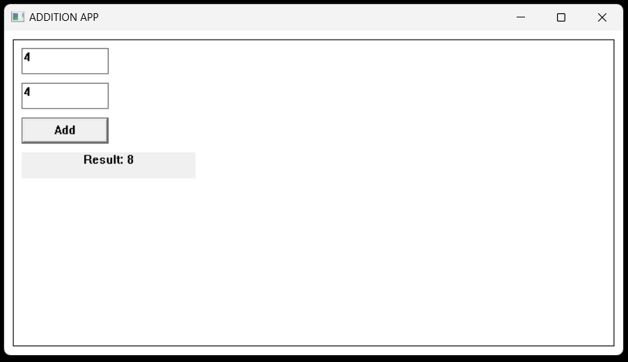

# Addition Project

The provided Win32 application written in C facilitates simple addition functionality within a graphical interface. Users can input two numbers, trigger the addition process with a button click, and view the result displayed in the application window.

## Technology Stack

`Win32 API` <br>
`C Programming` <br>
`Vs Code`

## How To Run This Project

                                
1. You will need to navigate to the location of your source code folder by using the "cd" command.

     ```shell
   cd source_code_location

2. Build exe file using following command.

    ```shell
   cl /Fe:app.exe Hello_Win.c

3. Run exe file using following command.

    ```shell
   app.exe

## Output



