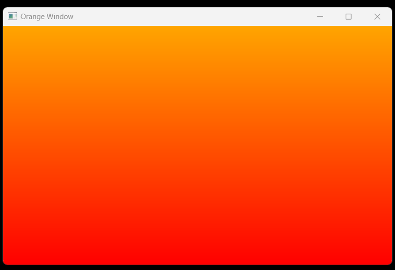

# Background Set Project2

This code is a Win32 application written in C that creates a window with a gradient background ranging from orange to red. It utilizes the Win32 API to register a window class, create a window, and handle messages for painting the gradient background. The gradient is drawn using the `GradientFill` function, providing a visually appealing background for the window.

## Technology Stack

`Win32 API` <br>
`C Programming` <br>
`Vs Code`

## How To Run This Project

                                
1. You will need to navigate to the location of your source code folder by using the "cd" command.

     ```shell
   cd source_code_location

2. Build exe file using following command.

    ```shell
   cl /Fe:app.exe Hello_Win.c

3. Run exe file using following command.

    ```shell
   app.exe

## Output



