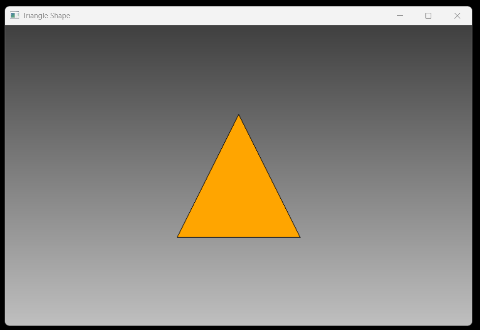

# Draw Triangle Project

This Windows application written in C creates a window with a gradient background and draws a single triangle in the center filled with an orange color. It utilizes the Windows API for window creation, drawing, and message processing.


## Technology Stack

`Win32 API` <br>
`C Programming` <br>
`Vs Code`

## How To Run This Project

                                
1. You will need to navigate to the location of your source code folder by using the "cd" command.

     ```shell
   cd source_code_location

2. Build exe file using following command.

    ```shell
   cl /Fe:app.exe Hello_Win.c

3. Run exe file using following command.

    ```shell
   app.exe

## Output



