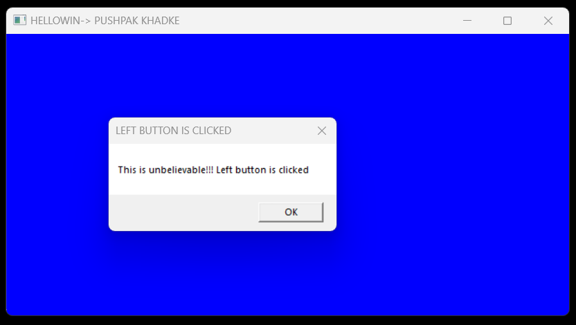

# MouseClickMessageApp

This Win32 application creates a standard window with a blue background. Upon left mouse button click, it displays a message box saying "This is unbelievable!!! Left button is clicked". Right mouse button clicks are ignored.


## Technology Stack

`Win32 API` <br>
`C Programming` <br>
`Vs Code`

## How To Run This Project

                                
1. You will need to navigate to the location of your source code folder by using the "cd" command.

     ```shell
   cd source_code_location

2. Build exe file using following command.

    ```shell
   cl /Fe:app.exe Hello_Win.c

3. Run exe file using following command.

    ```shell
   app.exe

## Output




