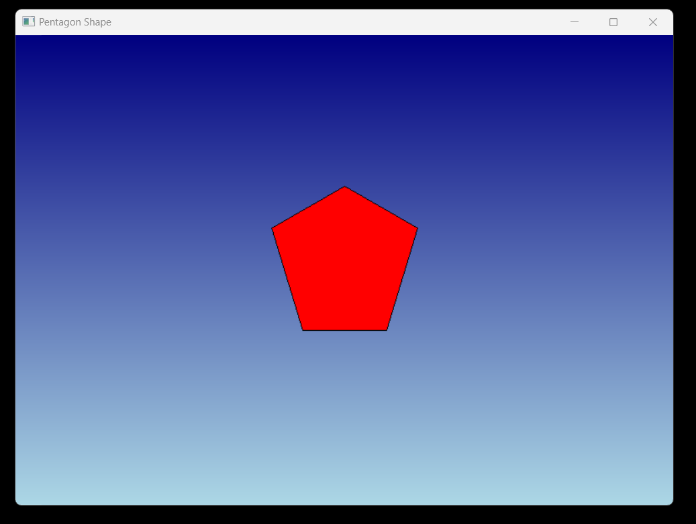

# Draw Pentagon Project

This Windows desktop application demonstrates basic graphics programming using the Win32 API. It displays a pentagon shape filled with a gradient color transition from dark blue to light blue within a graphical window.


## Technology Stack

`Win32 API` <br>
`C Programming` <br>
`Vs Code`

## How To Run This Project

                                
1. You will need to navigate to the location of your source code folder by using the "cd" command.

     ```shell
   cd source_code_location

2. Build exe file using following command.

    ```shell
   cl /Fe:app.exe Hello_Win.c

3. Run exe file using following command.

    ```shell
   app.exe

## Output



