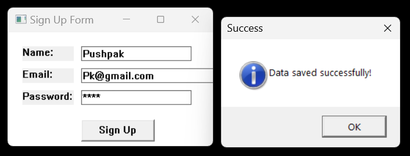

# Sign Up Form Project

The code creates a Win32 C application that creates a simple sign-up form. It includes text boxes for users to input their name, email, and password, along with a button to submit the sign-up information. Upon clicking the button, the data is saved into a file named "data.txt".

## Technology Stack

`Win32 API` <br>
`C Programming` <br>
`Vs Code`

## How To Run This Project

                                
1. You will need to navigate to the location of your source code folder by using the "cd" command.

     ```shell
   cd source_code_location

2. Build exe file using following command.

    ```shell
   cl /Fe:app.exe Hello_Win.c

3. Run exe file using following command.

    ```shell
   app.exe

## Output



