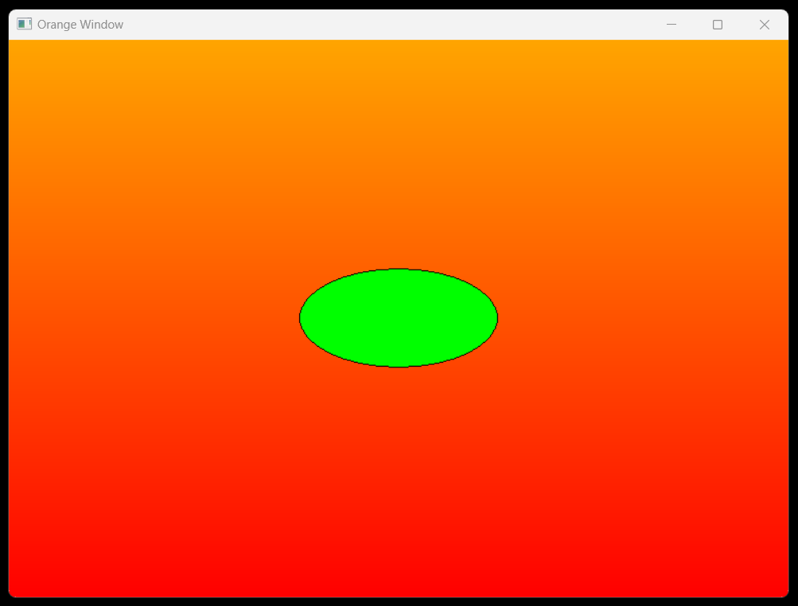

# Draw Ellipse Project

The provided code is a Windows application written in C, which creates a graphical window displaying an Ellipse shape filled with yellow color over a gradient background transitioning from dark red to light orange.


## Technology Stack

`Win32 API` <br>
`C Programming` <br>
`Vs Code`

## How To Run This Project

                                
1. You will need to navigate to the location of your source code folder by using the "cd" command.

     ```shell
   cd source_code_location

2. Build exe file using following command.

    ```shell
   cl /Fe:app.exe Hello_Win.c

3. Run exe file using following command.

    ```shell
   app.exe

## Output



