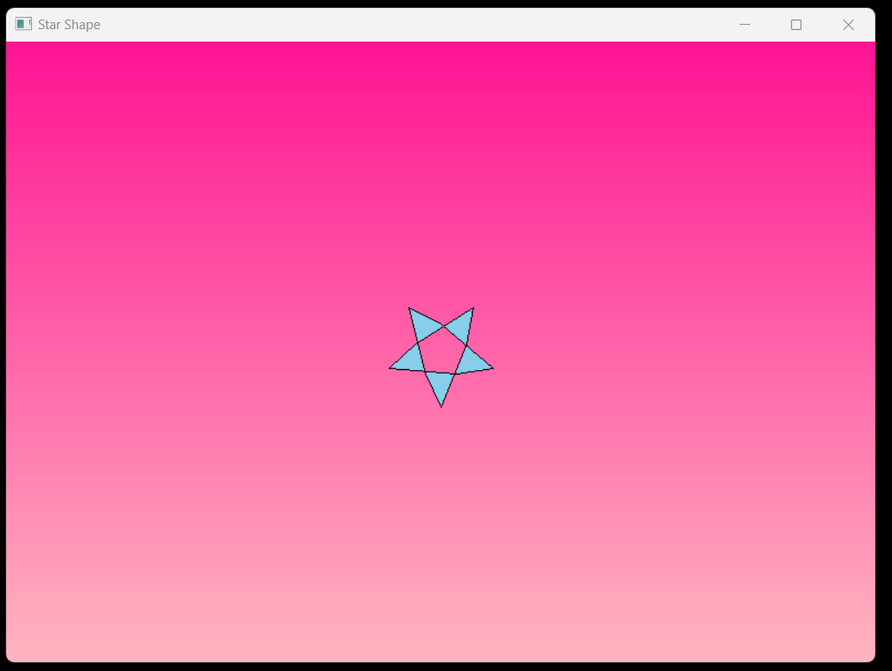

# Draw Star Shape Project

The is a Win32 application written in C that creates a window with a pink gradient background and draws a five-pointed star in the center. The gradient background transitions from dark pink to light pink. The star is drawn using mathematical calculations to determine the coordinates of its points.


## Technology Stack

`Win32 API` <br>
`C Programming` <br>
`Vs Code`

## How To Run This Project

                                
1. You will need to navigate to the location of your source code folder by using the "cd" command.

     ```shell
   cd source_code_location

2. Build exe file using following command.

    ```shell
   cl /Fe:app.exe Hello_Win.c

3. Run exe file using following command.

    ```shell
   app.exe

## Output



