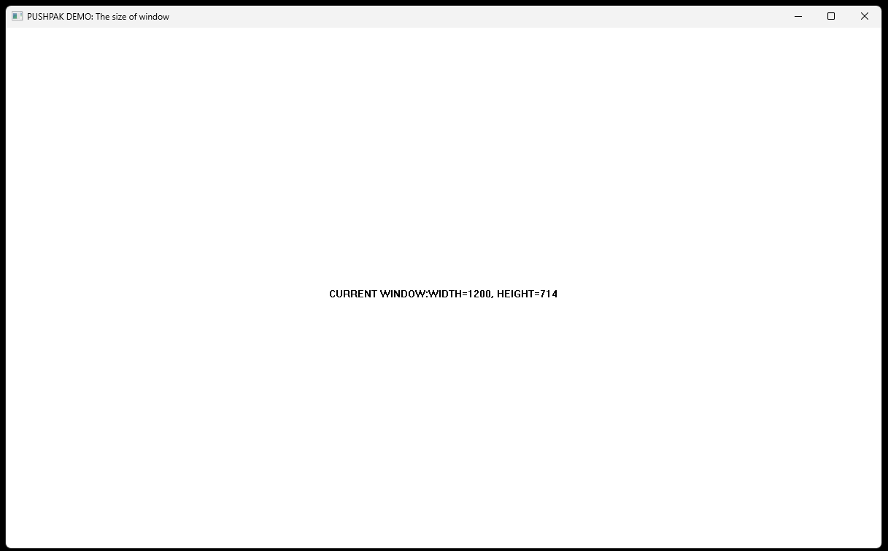

# Current Size Window

Create a simple Windows GUI application using the Win32 API in C. The application displays the current width and height of the window dynamically in the client area. The window also includes standard title bar controls such as minimize, maximize, and close buttons.


## Technology Stack

`Win32 API` <br>
`C Programming` <br>
`Vs Code`

## How To Run This Project

                                
1. You will need to navigate to the location of your source code folder by using the "cd" command.

     ```shell
   cd source_code_location

2. Build exe file using following command.

    ```shell
   cl /Fe:app.exe Hello_Win.c

3. Run exe file using following command.

    ```shell
   app.exe

## Output



