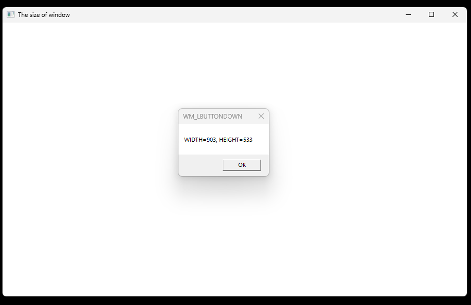

# Current Size of Window

Create a basic Win32 GUI application using C. This application will demonstrate how to handle window resizing and mouse click events. Specifically, we will display the current size of the window in a message box whenever the mouse button is clicked


## Technology Stack

`Win32 API` <br>
`C Programming` <br>
`Vs Code`

## How To Run This Project

                                
1. You will need to navigate to the location of your source code folder by using the "cd" command.

     ```shell
   cd source_code_location

2. Build exe file using following command.

    ```shell
   cl /Fe:app.exe Hello_Win.c

3. Run exe file using following command.

    ```shell
   app.exe

## Output



